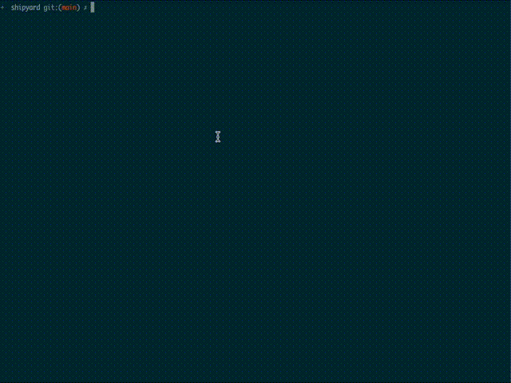

# Shipyard

Shipyard is a Forge template for smart contract development. See [the tutorial](exampleNftTutorial/README.md) for detailed instructions on using Shipyard or jump down to [the usage section](#usage) below for more info on how it works.

## Overview
Shipyard comes with some batteries included

- [OpenZeppelin](https://github.com/OpenZeppelin/openzeppelin-contracts), [Solady](https://github.com/Vectorized/solady), and Shipyard-core smart contracts as dependencies, ready with [`solc` remappings](https://docs.soliditylang.org/en/latest/path-resolution.html#import-remapping) so you can jump into writing your own contracts right away
- `forge fmt` configured as the default formatter for VSCode projects
- Github Actions workflows that run `forge fmt --check` and `forge test` on every push and PR
  - A separate action to automatically fix formatting issues on PRs by commenting `!fix` on the PR
- A pre-configured, but still minimal `foundry.toml` 
  - high optimizer settings by default for gas-efficient smart contracts
  - an explicit `solc` compiler version for reproducible builds
  - no extra injected `solc` metadata for simpler Etherscan verification and [deterministic cross-chain deploys via CREATE2](https://0xfoobar.substack.com/p/vanity-addresses).
  - a separate build profile for CI with increased fuzz runs for quicker local iteration, while still ensuring your contracts are well-tested



## Usage

Shipyard can be used as a starting point or a toolkit in a wide variety of circumstances. In general, if you're building something NFT related, you're likely to find something useful here. For the sake of exploring some of what Shipyard has to offer in concrete terms, here's a guide on how to deploy an NFT contract.

### Quick Deploy Guide

To deploy an NFT contract to the Goerli testnet, fund an address with 0.1 Goerli ETH, open a terminal window, and run the following commands:

Create a directory and `cd` into it:
```bash
mkdir my-shipyard-based-project &&
cd my-shipyard-based-project
```

Install the `foundryup` up command and run it, which in turn installs forge, cast, anvil, and chisel:
```bash
curl -L https://foundry.paradigm.xyz | bash
```

Follow the onscreen instructions output by the previous command to make Foundryup available in your CLI (or else restart your CLI).

Install forge, cast, anvil, and chisel by running:
```bash
foundryup
```

Create a new Foundry project based on Shipyard, which also initializes a new git repository, in the working directory.
```bash
forge init --template projectopensea/shipyard
```

Install dependencies and compile the contracts:
```bash
forge build
```

Set up your environment variables (make sure to swap in the appropriate value for `<your_pk>`):
```bash
export GOERLI_RPC_URL='https://eth-goerli.g.alchemy.com/v2/demo' &&
export MY_ACTUAL_PK_BE_CAREFUL='<your_pk>'
```

Run the script that deploys [the example contract](src/Dockmaster.sol) and mints an NFT:
```bash
forge script script/DeployAndMint.s.sol --private-key \
    $MY_ACTUAL_PK_BE_CAREFUL --fork-url $GOERLI_RPC_URL --broadcast
```

Verify the contract on Etherscan:

```bash
forge verify-contract <the_target_contract> Dockmaster --watch \ 
    --constructor-args $(cast abi-encode "constructor(string,string,address)" \ 
    "Dockmaster NFT" "DM" "0x0000000000000000000000000000000000000000") --chain 5
```

Running this command merely deploys the unchanged example NFT contract to a testnet, but it's a good way to check for a properly functioning dev environment.

See [the tutorial](exampleNftTutorial) for more detail on modifying the example contract, writing tests, deploying, and more.

### Reinitialize Submodules
When working across branches with different dependencies, submodules may need to be reinitialized. Run
```bash
./reinit-submodules
```

### Coverage Reports
If you plan on generating coverage reports, you'll need to install [`lcov`](https://github.com/linux-test-project/lcov) as well.

On macOS, you can do this with the following command:

```bash
brew install lcov
```

To generate reports, run
```bash
./coverage-report
```